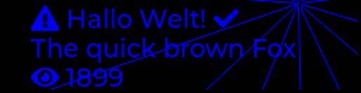

# OLED display driver for picorv32
Tested on [NHD-2.8-25664UCB2](http://www.newhavendisplay.com/specs/NHD-2.8-25664UCB2.pdf): 256 x 64 pixels, 16 shades.
Other displays with [ssd1322](https://www.newhavendisplay.com/app_notes/SSD1322.pdf#page=1&zoom=auto,-274,842) controller should also work.

This repo demonstrates the ssd1322 display driver on hardware (CMODA7). It's secondary use is to develop the GUI and GUI library for the AR analog chassis.

The actual re-usable library files are in `firmware/lib`. Everything else is just for demonstration / testing.

# Features
  * draw pixel
  * draw rectangle (outline or filled)
  * draw line (anti aliased)
  * draw text (anti aliased, variable or fixed width bitmap fonts, UTF-8 support, emojis!)

The font engine is a stripped down version of the one used in [LVGL](https://docs.lvgl.io/latest/en/html/overview/font.html).

Only 4 bit / pixel, no kerning, no compression, no bidirectional mode.

The LVGL [Font Converter](https://lvgl.io/tools/fontconverter) can be used to generate a `.c` file with custom font data.

# SDL simulation
The demo app can be previewed and developed on a PC using the [SDL](https://www.libsdl.org/) library for graphics output. See `sdl_sim/test.c`.

See [`psu_board_gui.c`](https://gitlab.lbl.gov/llrf-projects/analog_chassis_firmware/-/blob/master/lib/psu_board_gui.c) for a practical example on how to use this library to draw a GUI.
